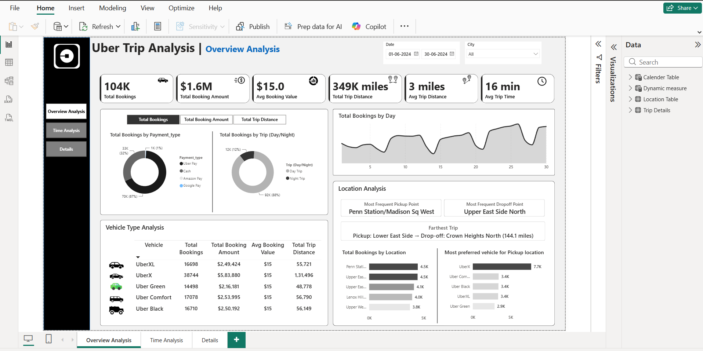
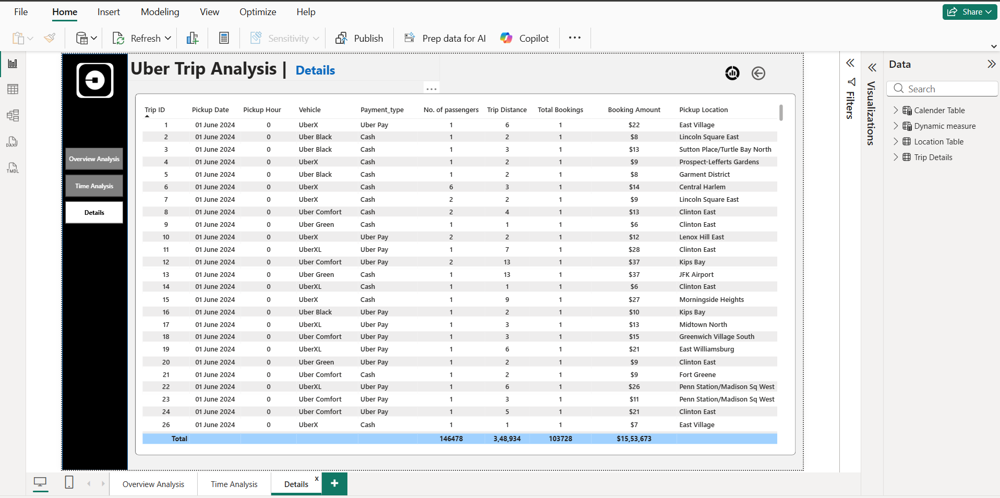

# Uber (Power-Bi-Dashboard)

## DAHBOARD 1: OVERVIEW ANALYSIS
Analyse Uber trip data using Power BI to gain insights into booking trends, revenue, and trip efficiency, helping stakeholders make data-driven decisions. 

KPI’s
1.	Total Bookings – How many trips were booked over a given period?
2.	Total Booking Value – What is the total revenue generated from all bookings?
3.	Average Booking Value – What is the average revenue per booking?
4.	Total Trip Distance – What is the total distance covered by all trips?
5.	Average Trip Distance – How far are customers travelling on average per trip?
6.	Average Trip Time – What is the average duration of trips?

## DAHBOARD 2: TIME ANALYSIS
To understand trip patterns based on time, Uber needs to analyse ride demand and trends across different time intervals. This dashboard will help in optimizing operations, pricing, and driver availability.

Global Dynamic Measure (Filters All Charts)
A measure selector will be created for:  
✔ Total Bookings  
✔ Total Booking Value  
✔ Total Trip Distance  
This dynamic measure will update all visuals based on user selection.

## DAHBOARD 3: DETAILS TAB
To provide in-depth insights and allow users to explore granular data, a Grid Tab will be created. This tab will enable drill-through functionality, allowing users to access detailed records based on selections made in other dashboards.

Features of the Grid Tab: 
1. Grid Table with Key Fields: 
•	Displays essential trip details 
2. Drill-Through Functionality: 
•	Users can right-click on a data point from other visuals (e.g., charts, heatmaps) and drill through to this Grid Tab.  
•	Displays detailed records related to the selected data point.  
3. Bookmark for Full Data View: 
•	A "View Full Data" bookmark to toggle between filtered drill-through data and the complete dataset.  
•	Allows users to reset filters and see all records easily.

## Dashboard Screenshots

### Overview Analysis

### Time Analysis

### Details 

